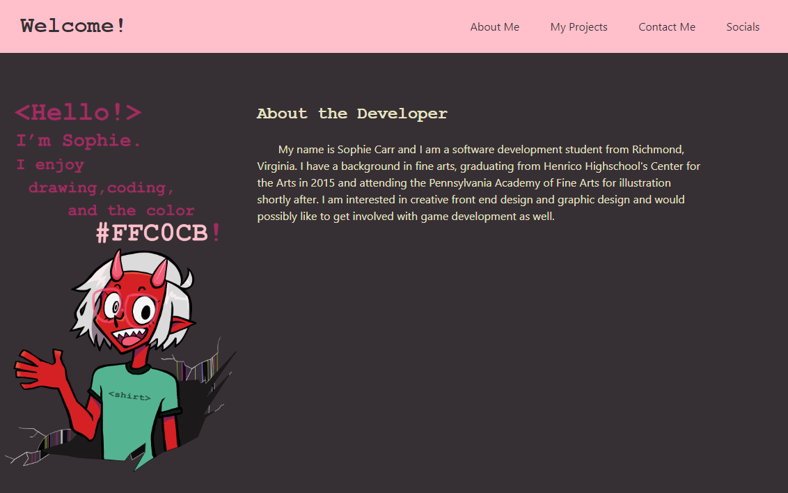

# Challenge 2: My First Portfolio

## Description

In this project I made a portfolio website to display the projects I've made so far as well as apply what I've learned about HTML and CSS. This project includes information about me as a developer, images and descriptions about my recent projects (and mock projects), links to my social media, and a contact form to get in touch with me directly. The navigation at the top of the page makes it easy to find each section without having to scroll, and the responsive layout makes it easy to view on all devices. Finishing this project further helped me to understand how HTML and CSS come together to make an exciting, responsive webpage for users to engage with.

## Screenshot

## Link to Deployed Site:

https://pinkywiththebrain.github.io/portfolio-challenge-2/